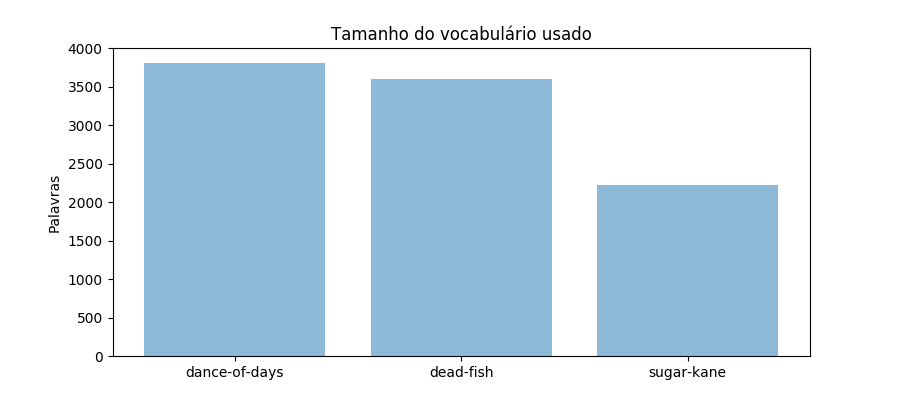
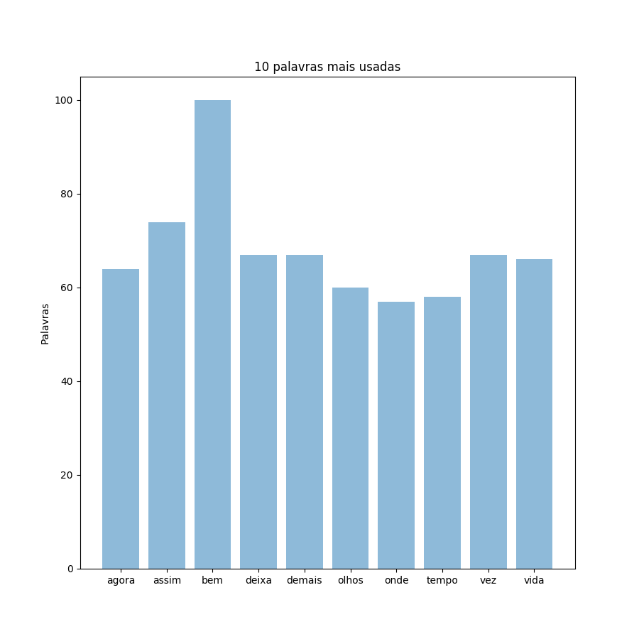
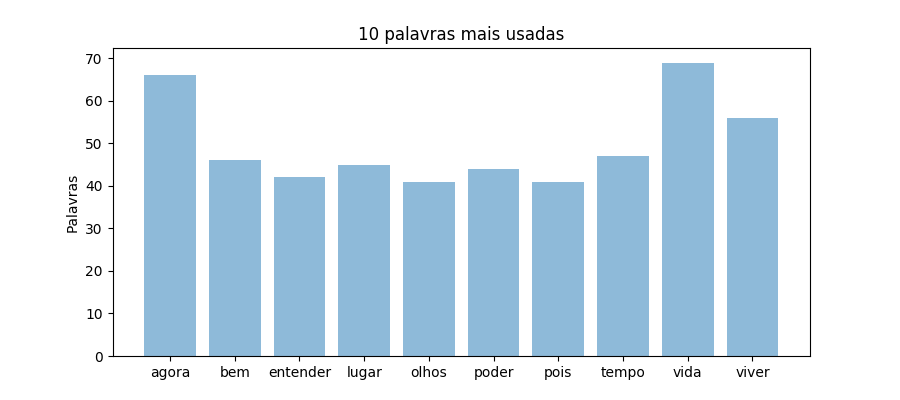
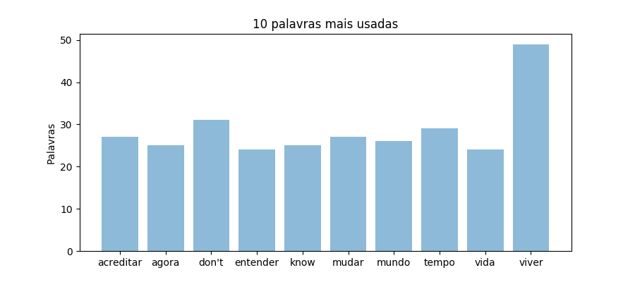

# HCCL (HardCoreCorpusLinguistics)

## 0. Qual o objetivo desse repositório?

Como objetivo não há nada de conclusivo, apenas curiosidade de saber sobre as algumas das bandas que eu mais escuto (e que tenham alguma coisa em comum*) e suas diferenças sob uma ótica "linguistica". Não há conteúdo ciêntifico nenhum nesse repositório e tbm não há uma veracidade nos dado utilizados, não pode nem mesmo ser considerado um corpora, pois no [site que usei como base](https://www.letras.mus.br/) para extração de texto, muitas musicas se apresentam de maneiras repetidas.

Outro ponto que cabe ser notado é que toda a análise foi feita (até agora) usando somente uma palavra (oone-gram). Pode-se se observar que não grande aprofundamento sendo comparada dessa maneira, pois não há uma disperção, porém nos ultimos tópicos falaremos sobre isso.

\* as bandas tem uma quantidade de discos parecidas e no inicio ambas cantavam em inglês

## 1. Como os dados foram coletados?

Os dados foram coletados via webscraping e o script se econtra [aqui](./scrap.py)

## 2. Comparativo lexical entre minhas bandas preferidas

### 2.1 Quantidade de palavras

Notoriamente Dance of days é a banda que tem mais palavras em seu vocabulário.
[Script usado](./images/quantidade_de_palavras.py)

### 2.2 10 palavras mais usadas por cada banda

Embora eu tenha tomado um pouco de cuidado, procurado por listas de stopwords em português, algumas palavras comuns ainda não foram removidas, quem sabe em uma proxima versão? O script usado está [aqui](./palavras_mais_comuns.py)

#### 2.2.1 Dance of days

#### 2.2.1 Dead fish

#### 2.2.2 Sugar Kane

### 2.3 Palavras mais comuns entre as 3 bandas

### 2.4 Palavras únicas de cada banda
